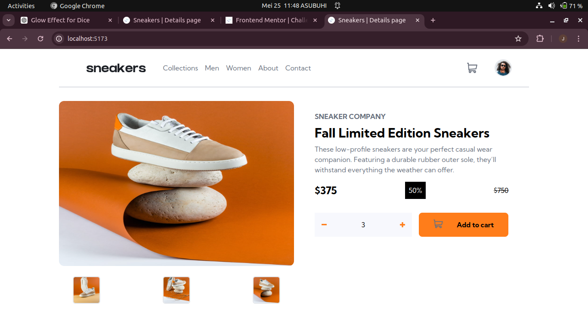
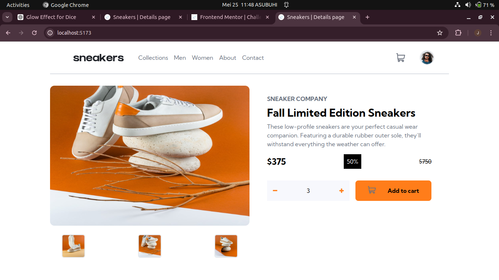
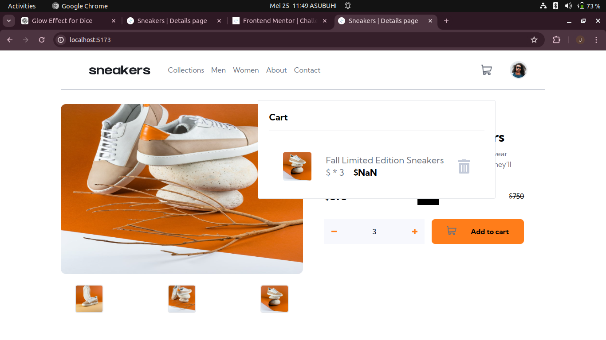

# Frontend Mentor - E-commerce product page solution

This is a solution to the [E-commerce product page challenge on Frontend Mentor](https://www.frontendmentor.io/challenges/ecommerce-product-page-UPsZ9MJp6). Frontend Mentor challenges help you improve your coding skills by building realistic projects.

## Table of contents

- [Overview](#overview)
  - [The challenge](#the-challenge)
  - [Screenshot](#screenshot)
  - [Links](#links)
  - [Built with](#built-with)
- [Author](#author)

## Overview

### The challenge

Users should be able to:

- View the optimal layout for the site depending on their device's screen size
- See hover states for all interactive elements on the page
- Open a lightbox gallery by clicking on the large product image
- Switch the large product image by clicking on the small thumbnail images
- Add items to the cart
- View the cart and remove items from it

### Screenshot

### Links

- Solution URL: [https://github.com/njeruthuo/ecommerce-product-details-page](https://github.com/njeruthuo/ecommerce-product-details-page)
- Live Site URL: [https://ecommerce-product-details-page-eight.vercel.app/](https://ecommerce-product-details-page-eight.vercel.app/)

## My process

### Built with

- Flexbox
- CSS Grid
- TailwindCSS
- CSS custom properties
- Semantic HTML5 markup
- Mobile-first workflow
- [React](https://reactjs.org/) - JS library

## Author

- Website - [Julius Njeru](https://frontend-portfolio-amber.vercel.app)
- Frontend Mentor - [@njeruthuo](https://www.frontendmentor.io/profile/njeruthuo)
- Twitter - [@njeru19_njeru](https://www.twitter.com/njeru19_njeru)